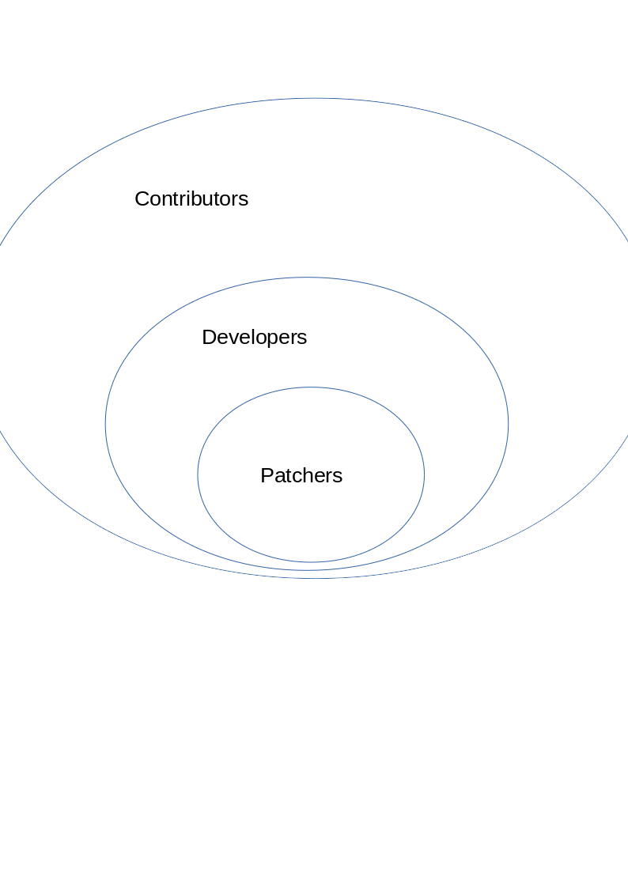

# All the Routes of the HTTP Server
There are two kinds of people,
that will use the Server:
- Contributors
Anyone changing the site in any way
- Users
Anyone registered on the network

Thus any route can be allocated to one
of those groups.

## Contributors
This Group can be separated again, which can be seen in
this Venn diagram:



Developers are all Contributors, working on the Source Code,
the difference to the other Contributors is, that Contributors
may also only or also change the human executable laws of the network,
which have rather little to do with Source Code.
Another subgroup in Developers are the Patchers, who are all
developers, currently working on their own Patch.

## Users
**All Users are guranteed to be human!**
This is important and to gurantee it, we don't have
a public register function **yet**.
All Users receive a RSA key pair,
which are used to encrypt their messages when stored on the
server.
The private key is encrypted using a random string encrypted again by the password of the user.
This is done to provide security, for example preventing the storage of the plain text password
of the user in either session or client.


# Routes
All these Routes are **POST**
## Contributor Routes
All Contributors Routes are prefixed
with `/contrib/` route.

### `/contrib/patch`
To create a patch.
A new patch is forked from the current `master` and created as a separate
Git Repo, that can be access on `dev.domain/<patcher>/<patch>` with the patcher's
password and user information as admin.
A new patch needs the following POST parameters:
```
patcher : <patcher's name>
is_user : <True if the patcher is user of the network, if they are, the patcher field is a network username
name    : <name of the patch, good title>
simple_description : <simple description using simple language
technical_description : <detailed description>
hold_pre_election : <True if the patcher wants to hold an election, before starting development>
references : <Links relevant to the patch>
if not is_user:
  temporary_password : <The Patcher's temporary password to access the patch and git repo>
```

### `/contrib/submit`
To close a patch.
Requires logged in patcher, either on the network or using their temporary password.
```
name : <Name of the patch, that is administrated by the patcher>
```

Most other adminstrations and communications, etc. are managed on `dev.domain`.

## User Routes
These have to prefixs.

### `/login`
Login a verified registered user
This sets the `SHA3-256_passphrase` and `keys` field in the `session`.
While the keys object in `keys` is still encrypted, it can be
decrypted using the `SHA3-256_passphrase`, which is the SHA3-256
Hash of the Password.
This is only stored in session and **never** written to disk.
We encrypt and decrypt using a Hash of the password instead
of the actual password to minimize the harm, that anyone
could do, that would read the sessions, because they'll
be unable to guess at the password's plain text form.
```
username : <username of the user, unique in all of the network>
password : <password of the user>
```
This going to write the SHA3-256 to `SHA3-256_passphrase`
and encrypted `keys`, which are encrypted using `SHA3-256_passphrase`.

### `/vote`
Vote on an election.
**On this Route logging and any other kind of documentation must
be stopped.**
```
election : <election hash>
vote : [<choice1>,<choice2>,<choice3>,…]
```
This requires logged in users.

### `/message`
Send a message to some recipients.
```
to : [<list of recipient's usernames>
body : message text
```
The body will be encrypted with the private key of the author
and the public key of all the recipients, unless one of the
recipients is `"all"`, in which case the message is a
post and public and only signed by the author for authentication
purposes.


# Error Codes
If a route returns one of these codes, there has been an error:

| Codes | Meaning                                   |
|-------|-------------------------------------------|
| 0     | OK                                        |
| 1     |  Invalid Data                             |
| 2     | Unable to do that Action in given context |
